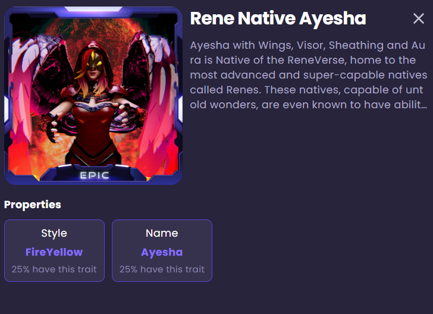

# ReneverseAPIManager

The `ReneverseAPIManager` is the entry point to all functionality of the Unity SDK.

You initialize the SDK with `API()` function it provides and use the instance to access the different methods and properties of the SDK.

## Usage

The `API()` method returns the ReneVerse API client.

```csharp
API ReneAPI = ReneAPIManager.API();
```

## Examples

### Connecting to Reneverse

```csharp
using UnityEngine;

//Import the required namespace
using Rene.Sdk;
using ReneVerse;

public class ReneverseManager : MonoBehaviour
{
    //Create an API instance to use throughout this class
    private API ReneAPI;
    //Text Mesh Pro - Input Field for Email
    public GameObject Email;
    
    void Start()
    {
        //When the game starts, set up the Reneverse API
        ReneAPI = ReneAPIManager.API();
    }
    
    //Connect User function
    async Task ConnectUser()
    {
        
        string EmailHandler = Email.GetComponent<TMP_InputField>().text;

        if (!EmailHandler.IsEmail())
        {
            Debug.Log("Please provide a valid Email");
            return;
        }

        bool connected = await ReneAPI.Game().Connect(EmailHandler);
        Debug.Log(connected);

        if (!connected)
        {
            Debug.Log("Error Connecting");
            SignInButton.SetActive(true);
            return;
        }

        StartCoroutine(ConnectReneService());
    }
}
```

**References**

* [connect.md](gameapi/connect.md "mention")

Afterwards you have many ways to implement loaded from ReneVerse service information about users' Assets and here is one of them. We can use Coroutines since they are Unity specific and less error prone:

```csharp
StartCoroutine(ConnectReneService());
```

### Ask for Authorization

As you remember we are waiting for the user to accept his entry into the ReneVerse system and to get an access to their assets. In order to achieve this you could do the following :

```csharp
//Function to check, if the user is authorizing through Reneverse Dashboard
private IEnumerator ConnectReneService()
{
    var counter = TimeToWait;
    var userConnected = false;
    //Interval how often the code checks that user accepted to log in
    var secondsToDecrement = 1;
    while (counter >= 0 && !userConnected)
    {
        Timer.text = counter.ToString();
        if (ReneAPI.IsAuthorized())
        {

            //Here can be added any extra logic once the user logged in

            yield return GetUserAssetsAsync();


            userConnected = true;
        }

        yield return new WaitForSeconds(secondsToDecrement);
        counter -= secondsToDecrement;
    }
}
```

**References**

* [isauthorized.md](api/isauthorized.md "mention")

### Get User Assets

Now let's look at the `GetUserAssetsAsync(reneApi)` method that has the necessary information in it:

```csharp
//Get all the NFTs owned by the user in this game
private async Task GetUserAssetsAsync()
{
    AssetsResponse.AssetsData userAssets = await ReneAPI.Game().Assets();
    //By this way you could check in the Unity console your NFT assets
    userAssets?.Items.ForEach(asset => Debug.Log
        ($" - Asset Id '{asset.NftId}' Name '{asset.Metadata.Name}"));

    userAssets?.Items.ForEach(asset =>
    {
        string assetName = asset.Metadata.Name;
        string assetImageUrl = asset.Metadata.Image;
        string assetStyle = "";
        asset.Metadata?.Attributes?.ForEach(attribute =>
        {
        //Keep in mind that this TraitType should be preset in your Reneverse Account
            if (attribute.TraitType == "Style")
            {
                assetStyle = attribute.Value;
            }
        });
        //An example of how you could keep retrieved information
        Asset assetObj = new Asset(assetName, assetImageUrl, assetStyle);
        //one of many ways to add it to the game logic
        //_assetManager can be of list datatype 
        _assetManager.userAssets.Add(assetObj);
    });
}
```

**References**

* [assets.md](gameapi/assets.md "mention")

Here is an example and indeed the name of the Attribute is "Style"



You set this values once you create assets and can modify them in this menu:


**`An example of Asset entity`**

Here is how Asset class is set up in our case but it is up to you how you hook up the retrieved information within your game.

```csharp
public class Asset
{
    public string AssetName { get; set; }
    public string AssetUrl { get; set; }

    public string AssetStyle {get; set;}
    public Asset(string assetName, string assetUrl, string assetStyle)
    {
        AssetName = assetName;
        AssetUrl = assetUrl;
        AssetStyle = assetStyle;
    }
}
```

